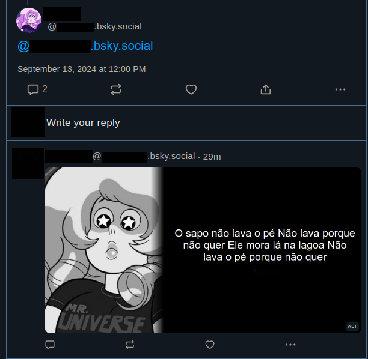

# Quote this

A bot for bluesky that will turn the post in a quote.



## How to use it

You will need to create a .env file copying it from .env.example and put the info there

```
BSKY_IDENTIFIER is the email of you bluesky account
BSKY_PASSWORD is the password of your bluesky account
BSKY_USERNAME is the username (without the @) that when tagged will call the function to post
```

Then install all dependencies
```bash
npm install
```

and run
```bash
npm run dev
```
